# big-screen-cinemas
# 🎬 Big Screen Cinemas

Cinema ticket reservation system built using **ASP.NET**, **Visual Studio**, and **SQL Server**.

## 🔧 Technologies
- ASP.NET (C#)
- SQL Server
- Visual Studio 2010
- Two-tier architecture

## 🧪 Features
- Admin login/dashboard
- Customer ticket booking
- Feedback system
- Ticket cancellation
- Database-driven UI

## 📁 File Structure
- `src/`: Source code (ASPX + code-behind)
- `database/`: SQL Server `.mdf` file
- `docs/`: Full project documentation
- `screenshots/`: UI images

## 🚀 Run It Locally
1. Open solution in Visual Studio.
2. Attach the `.mdf` database using SQL Server Management Studio.
3. Update `Web.config` if needed.
4. Run project via IIS Express.

## 🖼 Screenshots

| Page | Screenshot |
|------|------------|
| Flash Screen | 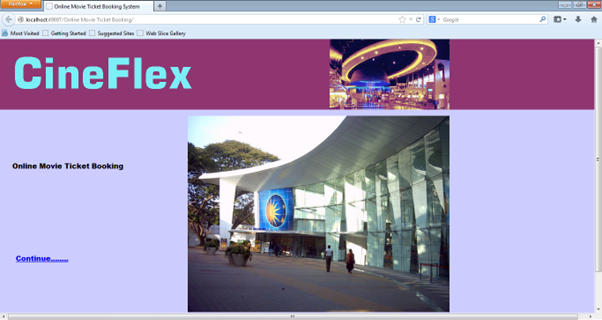  |
| Main Page | 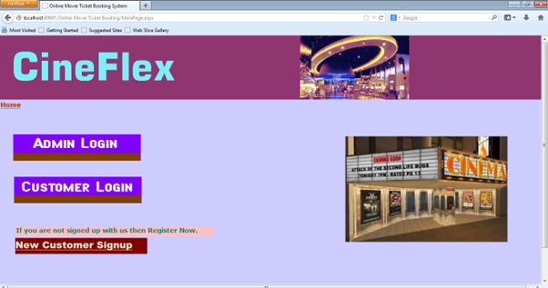  |
| Admin Login | 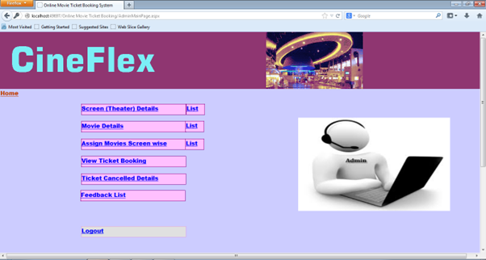  |
| Admin Screen Details | 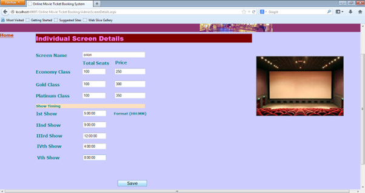  |
| Admin Movie Details | 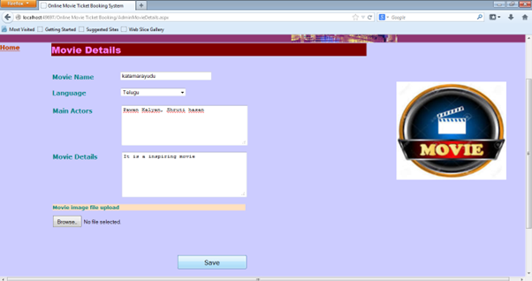  |
| View Ticket Booking Details | 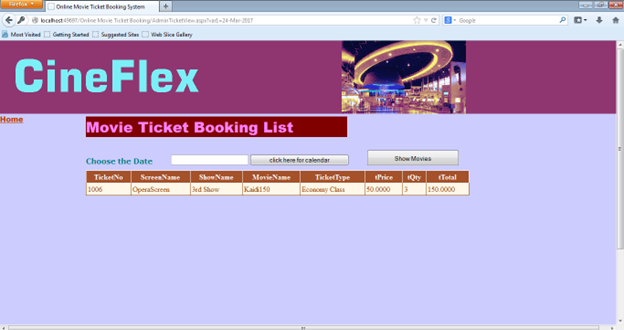  |
| Customer Signup Page | 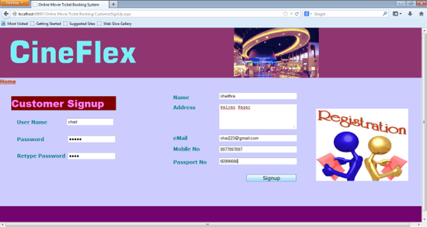  |
| Customer Login | 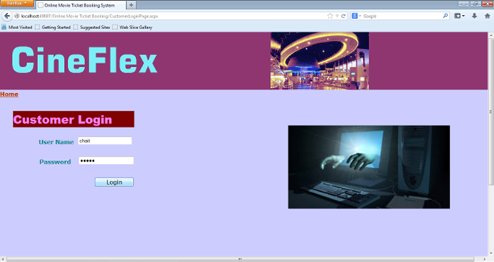  |
| Customer Main Page | 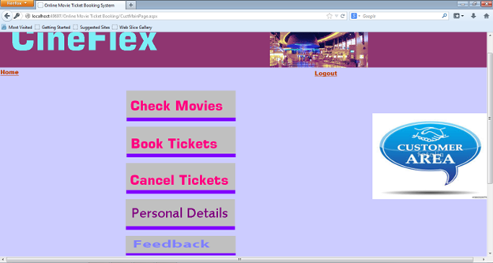  |
| Check Movies Page | 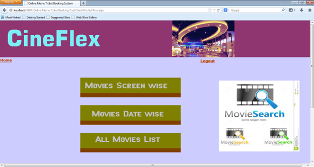  |
| Movies Screen Page | 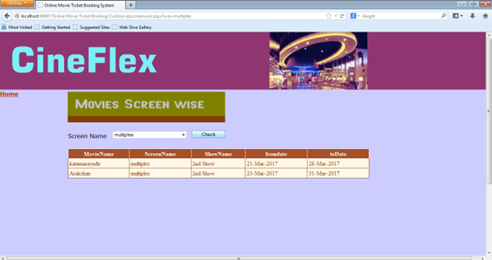  |
| All Movies List Page | 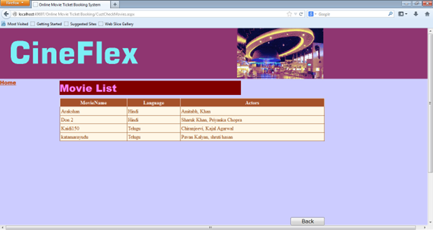  |
| Selecting Movies fo Ticket Booking | 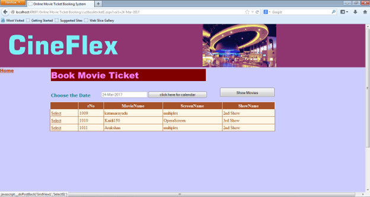  |
| Booking Page | 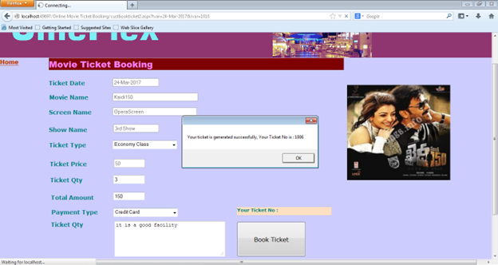  |
| Cancelling Movie Ticket | 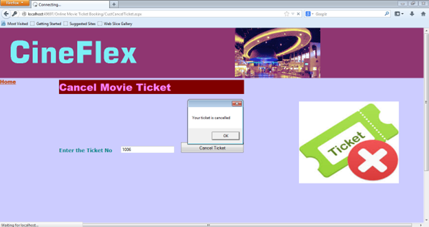  |
| Customer Personal Details | 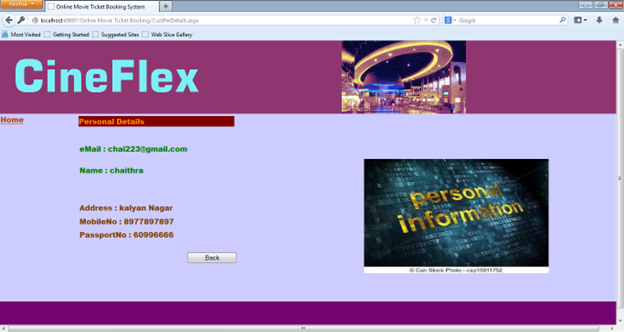  |
| Feedback Form | 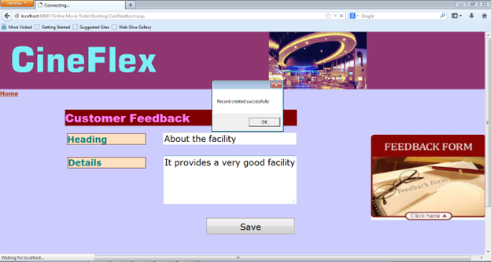  |

## 📄 License
Open-source for educational use.

## 📄 Documentation

- [Project Report (PDF)](docs/Project_Report.pdf)

